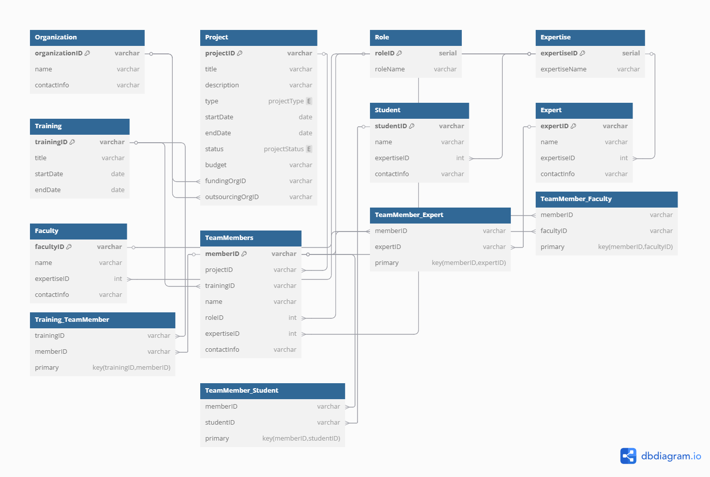

# RTCU Content Management System

## Overview
The **RTCU Content Management System (CMS)** is designed to efficiently manage and track research, training, and consultancy projects associated with the Research, Training, and Consultancy Unit (RTCU) under Tribhuvan University. The system allows seamless management of projects, training programs, and team members.

## Features
- **Project Management**: Create, update, delete, and retrieve projects.
- **Training Program Management**: Maintain a record of training sessions and participants.
- **Role-Based Access**:
  - **Guest Mode** (Not Logged In): Users can view projects, training programs, and team details.
  - **Admin Mode** (Logged In): Full access to manage content.
- **User Categories**:
  - Students
  - Experts
  - Faculty
- **Data Integrity**: Enforced using entity relationships and foreign key constraints.

## ER & Schema Diagram



Screenshots of the project are available here : https://drive.google.com/file/d/1jpJ24BOL2SDA8F2m6Lep3d1jUuMyiR_O/view?usp=sharing

## Entity Descriptions
| Entity | Description |
|--------|-------------|
| **Organization** | Represents entities that fund or outsource projects. |
| **Project** | Represents a research or consultancy project. |
| **TeamMembers** | Central entity representing all project participants. |
| **Student** | Students participating in projects. |
| **Experts** | Industry/domain experts involved in projects. |
| **Faculty** | Faculty members contributing to projects. |
| **Role** | Various roles assigned within a project. |
| **Expertise** | Area of expertise of team members. |
| **Training** | Records of training programs. |

## Tech Stack
- **Frontend**: React.js, Tailwind CSS
- **Backend**: Node.js, Express.js
- **Database**: PostgreSQL

## Installation & Setup
1. **Clone the repository**
   ```bash
   git clone https://github.com/your-repo/rtcu-cms.git
   cd rtcu
   ```
2. **Install dependencies**
   ```bash
   npm install
   ```
3. **Set up database** (PostgreSQL required)
   - Create a database and configure `.env` file with credentials.
4. **Run the development server**
   ```bash
   npm run dev
   ```
